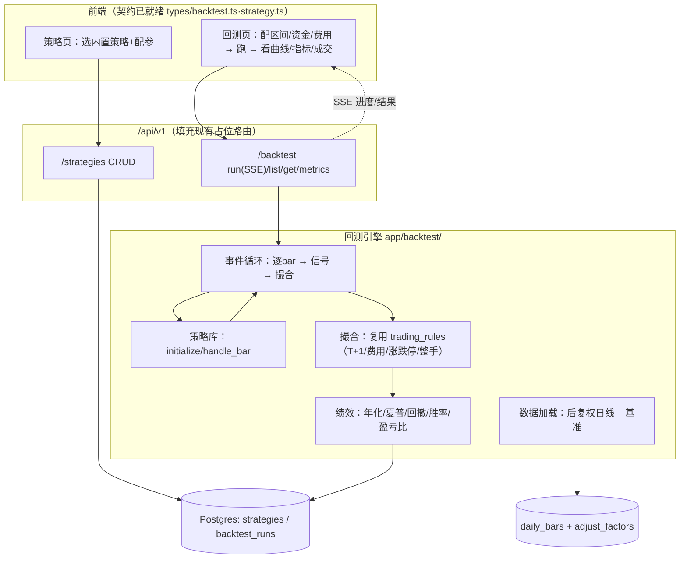

# Phase 4 · 回测引擎 MVP 设计方案

> 目标：在现有「真实数据底座 + 模拟交易撮合 + 前端契约」之上，落地一个**严谨、可信、可解释**的 A 股日频回测引擎。
> 原则：复用已有资产、对齐前端已定义的类型、PIT 正确性优先、范围克制、小步可交付。

---

## 1 · 目标与范围

### MVP 目标（做什么）
- **日频**事件驱动回测：选标的池 + 选策略 + 设区间/初始资金/费用 → 跑出权益曲线、绩效指标、成交明细。
- **A 股规则内建**：T+1、100 股整手、涨跌停限制、佣金（万2.5/最低5）、卖出印花税（千1）、滑点。
- **后复权**价计算（PIT 正确），对比基准（沪深300）算超额。
- **内置策略库 + 参数化**（双均线 / RSI / 布林带 / 动量），端到端跑通，**不开放任意代码执行**。
- 全程 **SSE 流式进度** + 结果落库可回看，复用成本闸限流。

### 非目标（MVP 不做，后置）
- ❌ 用户自定义 Python 策略代码沙箱执行（安全坑，见 §11）。
- ❌ 分钟级 / Tick 级回测（数据已具备分钟K，但先稳住日频）。
- ❌ 多因子流水线 / 参数寻优 / 向量化批量回测（Phase 4.1+）。
- ❌ backtrader / qlib 深度集成（见 §2 决策）。
- ❌ 实盘对接。

---

## 2 · 关键设计决策

### 决策 1：引擎抽象层 + 自研默认实现，backtrader 预留可插拔
**结论**：定义统一的 `BacktestEngine` 抽象接口；MVP 提供**自研事件驱动引擎 `native`** 为默认实现，并**预留 `backtrader` 适配器**（接口/骨架就绪、实现后置）。上层 API 与策略层不感知具体引擎，经 `config.engine = "native" | "backtrader"` 一键切换（呼应 `DataProvider` 可热插拔风格）。

**为何默认自研 `native`**：
- A 股 T+1 / 涨跌停 / 印花税 / 整手在 backtrader 需大量定制；自研可**直接复用 `trading.py` 撮合/费用逻辑**，口径统一、易单测、可控。
- 数据量级（单次回测几十标的 × 数年日线）纯 Python 秒级足够。

**为何预留 backtrader（保留方案）**：
- 未来需要更丰富的 order 类型 / 指标库 / 分钟级 / 社区生态时，可接入 backtrader 而**不重写策略层与 API**。
- 风险隔离：自研引擎结果可与 backtrader 交叉验证（对拍），增强可信度。

**预留代码（M1 即落地骨架）**：
- `app/backtest/base.py`：`BacktestEngine` ABC（`run(config, strategy, data) -> EngineResult`）+ 通用数据结构（`Bar` / `Order` / `Fill` / `EngineResult`）。
- `app/backtest/registry.py`：`ENGINE_REGISTRY` + `get_engine(name)`，缺省 `native`。
- `app/backtest/engines/native.py`：自研实现（M1 骨架 → M2 完整事件循环）。
- `app/backtest/engines/backtrader_engine.py`：`BacktraderEngine` 适配器骨架——惰性检测 `backtrader` 依赖（未安装则友好报错），`run()` 暂 `raise NotImplementedError`，并以 TODO 标注接入要点（`cerebro` 装配、`PandasData` 馈送、A股 `CommissionInfo`(佣金+印花税)、T+1 `Sizer`/约束、与 `EngineResult` 的结果映射）。

### 决策 2：策略以「内置库 + 参数」为主，代码执行后置
前端 `Strategy.type` 已枚举 `trend_following / mean_reversion / momentum / ...`，`params` 为自由字典。
MVP 用**内置策略注册表**（每种策略一个类 + 参数 schema），用户只配参数。`Strategy.code` 字段保留给后续「高级模式」。

### 决策 3：抽出共享「交易规则层」
把 `trading.py` 里的费用/整手/T+1 常量与函数抽到 `app/services/trading_rules.py`，**模拟交易与回测共用**，保证两处口径一致（佣金、印花税、整手）。

---

## 3 · 架构总览



**数据流**：配置 → 加载后复权数据 → 逐 bar 事件循环（策略出信号→撮合记账）→ 汇总绩效 → 落库 + 流式返回。

---

## 4 · 数据层（PIT 正确性核心）

### 后复权价服务（新增）
现状 `get_kline` 直接读 `daily_bars`（**不复权**），回测若用裸价，除权日会假性跳空。

新增 `app/backtest/data.py`：
```python
def load_hfq_bars(code: str, start: str, end: str) -> list[Bar]:
    """读 daily_bars + adjust_factors，输出后复权(HFQ) OHLC。
    后复权不改变历史相对收益、适合回测；前复权会随新除权变动历史，不用于回测。"""
    # close_hfq = close * back_adjust_factor（按 ex_date 阶梯应用）
```
- 用 `AdjustFactor.back_adjust_factor` 按 `ex_date` 阶梯调整 OHLC。
- 缺复权因子的标的：标注 `adjustCoverage=partial`，回测结果带数据质量提示（延续「绝不杜撰、显式标注缺口」原则）。

### PIT 守则
- 每根 bar 只能用 **截至当日及之前**的数据出信号（禁止未来函数）。
- `handle_bar(t)` 的下单在 **t+1 开盘**成交（避免用当日收盘信号在当日收盘成交的前视偏差），或当日收盘成交但显式声明口径。MVP 采用 **次日开盘成交**（更严谨）。
- 退市/停牌：停牌日不撮合；已退市标的按最后交易日处理（用 `instruments.delist_date`）。

---

## 5 · 策略 API（聚宽 / RQAlpha 风格）

```python
class Strategy(Protocol):
    def initialize(self, ctx: Context) -> None: ...      # 设置标的池、参数、调仓频率
    def handle_bar(self, ctx: Context, bars: dict[str, Bar]) -> None: ...  # 每个交易日调用

# Context 提供的能力（受控、无任意 IO）：
ctx.order_target_percent(code, 0.2)   # 调到目标仓位比例
ctx.order_shares(code, 100)           # 按股数下单（自动整手校验）
ctx.portfolio                         # 现金/持仓/总资产
ctx.history(code, "close", 20)        # 截至当日的历史窗口（防未来函数）
ctx.params                            # 用户配置参数
```

**内置策略库**（`app/backtest/strategies/`，每个带参数 schema）：
| 策略 | 参数 | 信号 |
|---|---|---|
| 双均线 `dual_ma` | fast, slow | 金叉买/死叉卖 |
| RSI 反转 `rsi` | period, low, high | 超卖买/超买卖 |
| 布林带 `boll` | period, k | 触下轨买/上轨卖 |
| 动量 `momentum` | lookback, topN | 截面动量轮动 |

注册表模式：`STRATEGY_REGISTRY[type] -> (StrategyClass, ParamSchema)`，新增策略只加一项，前端按 schema 渲染参数表单。

---

## 6 · 回测引擎核心

```
for trade_date in trading_calendar(start, end):
    bars = loader.bars_at(trade_date)          # 当日后复权 OHLC（停牌剔除）
    broker.settle_t1(trade_date)               # T+1 解冻（复用 trading_rules 口径）
    broker.fill_pending_open(bars)             # 昨日信号 → 今日开盘撮合（涨跌停/整手/费用/滑点）
    strategy.handle_bar(ctx, bars)             # 策略出今日信号（仅用 ≤今日数据）
    equity.append(broker.mark_to_market(bars)) # 当日收盘按市值记权益
```

**撮合规则（复用 `trading_rules`）**：
- 买入需现金足额（含佣金）；卖出受 T+1 可用约束。
- **涨跌停**：开盘涨停→买单不成交（顺延/作废）；跌停→卖单不成交。涨跌停幅度按板块（主板±10% / 创业板·科创板±20% / ST±5%）。
- **整手**：买入向下取整到 100 股；`order_target_percent` 同理。
- **滑点**：成交价 = 开盘价 ×(1 ± slippage)（买+卖-），`slippage` 来自 `BacktestConfig`。
- **费用**：佣金 `max(amount×0.00025, 5)`，卖出加印花税 `amount×0.001`。

---

## 7 · 绩效指标（对齐前端 `BacktestMetrics`）

逐项产出前端已定义字段：
- `totalReturn(Percent)`、`annualReturn(Percent)`（按交易日 252 年化）
- `sharpeRatio`（无风险利率默认 0，可配）、`sortinoRatio`（仅下行波动）
- `maxDrawdown(Percent)`（权益曲线峰谷）
- `winRate / profitFactor / averageWin / averageLoss / totalTrades / winningTrades / losingTrades`
- `equityCurve: EquityPoint[]`、`trades: TradeRecord[]`

**成交配对**：前端 `TradeRecord` 是 round-trip（entry/exit 配对）。引擎按 **FIFO** 把买卖配成平仓回合，算每笔 `return / returnPercent / commission`。
**基准对比**：默认沪深300（`000300.SH`），同期净值叠加 + 超额收益。

---

## 8 · 数据模型（新增 ORM）

```python
class Strategy(Base):           # 对齐前端 Strategy
    id, user_id, name, description
    type            # dual_ma / rsi / boll / momentum
    params_json     # 用户参数
    status          # draft / active / paused / stopped
    created_at, updated_at

class BacktestRun(Base):        # 对齐前端 BacktestResult
    id, user_id, strategy_id
    config_json     # BacktestConfig（区间/资金/佣金/滑点/标的池）
    status          # pending / running / completed / failed
    metrics_json    # BacktestMetrics
    equity_json     # EquityPoint[]（或大数据走单独表/列存）
    trades_json     # TradeRecord[]
    error, created_at, completed_at
```
> 权益/成交量大时，`equity_json` 可改存 Parquet/DuckDB（SPEC 列存留 Phase 4 引入），MVP 先 JSON 落库够用。

---

## 9 · API 设计（填充现有占位）

复用 `backtest.py` / `strategies.py` 已有路由形态（当前返回 501/空），改为真实实现：

| 方法 | 路由 | 说明 |
|---|---|---|
| GET/POST/PUT/DELETE | `/strategies...` | 策略 CRUD（内置类型 + 参数校验） |
| POST | `/backtest/run` | **SSE 流式**：`{stage}` 进度 → `{metricsPartial}` → `{done, runId}`；走 `ai_cost_gate` 同源的回测配额闸 |
| GET | `/backtest` `/{id}` `/{id}/metrics` | 列表 / 详情 / 指标，回看历史回测 |

请求/响应严格对齐前端 `BacktestConfig` / `BacktestResult`，前端页面（已从 coming-soon 预留）可直接对接。

---

## 10 · 复用清单（最大化已有资产）

| 现成可复用 | 用途 |
|---|---|
| `daily_bars` + `adjust_factors` | 回测数据源（补后复权计算） |
| `trading.py` 费用/T+1/整手逻辑 | 抽 `trading_rules` 共享给撮合 |
| 前端 `types/backtest.ts` `strategy.ts` | 契约已定义，零返工 |
| 占位 `backtest.py` `strategies.py` 路由 | 直接填充实现 |
| SSE 工具 + `ai_cost_gate` | 流式进度 + 回测限流 |
| `instruments`(list/delist_date) | 停牌退市处理 |
| 前端 ECharts 封装 | 权益曲线 / 回撤图 |

**需新建**：`app/backtest/`（data 后复权、engine 事件循环、broker 撮合、strategies 策略库、metrics 绩效）、2 个 ORM、策略/回测 service、前端两页接线。

---

## 11 · 风险与取舍

| 风险 | 对策 |
|---|---|
| **用户代码执行安全** | MVP 不开放；仅内置策略+参数。高级模式后置（子进程隔离 + RestrictedPython + 资源限额） |
| 复权因子覆盖不足（现仅少量标的） | 回测前校验覆盖率，缺失标注 `dataQuality`，并提示先 `backfill --start` 补 adjust |
| 前视偏差 / 未来函数 | 次日开盘成交 + `ctx.history` 只给 ≤当日数据；单测专门校验 |
| 幸存者偏差 | 标的池含已退市标的、用 `delist_date` 截断（PIT 字段已预留） |
| 长回测权益数据大 | MVP JSON 落库；超阈值转列存（DuckDB/Parquet） |
| 涨跌停/停牌口径复杂 | MVP 按板块固定幅度 + 停牌剔除，文档声明简化口径 |

---

## 12 · 里程碑（小步可交付）

| 里程碑 | 内容 | 验收 |
|---|---|---|
| **M1 地基+引擎骨架** | `trading_rules` 抽取共享；`load_hfq_bars` 后复权 + 交易日历；`BacktestEngine` 抽象 + `ENGINE_REGISTRY` + native 骨架 + **backtrader 预留适配器** | 后复权价单测对齐已知除权案例；费用口径与模拟交易一致；`get_engine("backtrader")` 友好报「未实现/需安装」 |
| **M2 引擎闭环** | 事件循环 + broker 撮合 + 1 个策略(双均线) + 绩效指标 | 单标的双均线回测产出正确权益/指标；前视偏差单测通过 |
| **M3 API + 落库 + 前端** | 填充 backtest/strategies 路由（SSE）+ ORM + 前端两页接线 | 前端可配置→跑→看曲线/指标/成交；历史可回看 |
| **M4 策略库 + 基准 + AI** | 补 RSI/布林/动量 + 沪深300基准 + **AI 回测点评**（复用复盘 Prompt 模式） | 4 策略可选、超额收益展示、AI 给出策略诊断 |

每个里程碑独立可演示、独立提交（沿用 `feat(backtest)` 分层提交）。

---

## 13 · 与「共创招募」的衔接

- M2 后即可邀请量化朋友：**新增内置策略只需实现一个 `handle_bar` + 参数 schema**，注册表自动接入——贡献门槛低。
- 绩效口径、A 股规则（涨跌停/T+1/费用）、PIT 守则是最需要专业把关的点，正好作为共创讨论的切入。
- AI 回测点评（M4）把「策略结果 + 真实数据」喂给 LLM 做诊断，延续项目「AI 原生 + 数据接地」的差异化。

---

## 14 · 一句话总结

**自研轻量事件驱动引擎**，复用模拟交易的撮合/费用/T+1 与现有数据底座，对齐前端既定契约，以**内置策略库 + 后复权 + PIT 严谨性**先跑通可信的日频回测闭环；backtrader/qlib、分钟级、代码沙箱、参数寻优作为后续增量。
