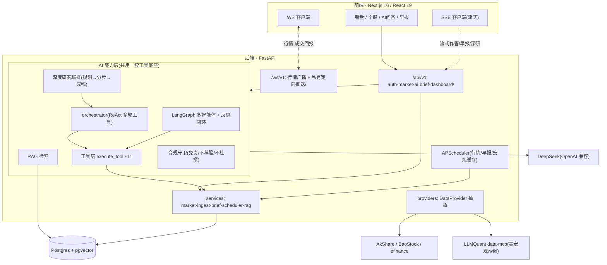
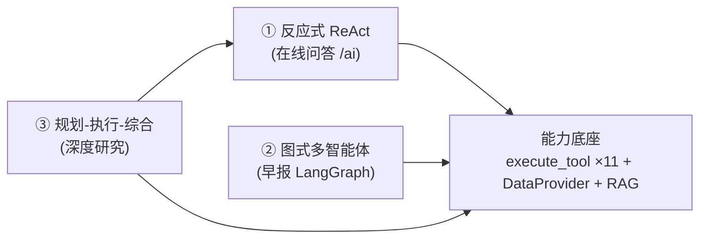
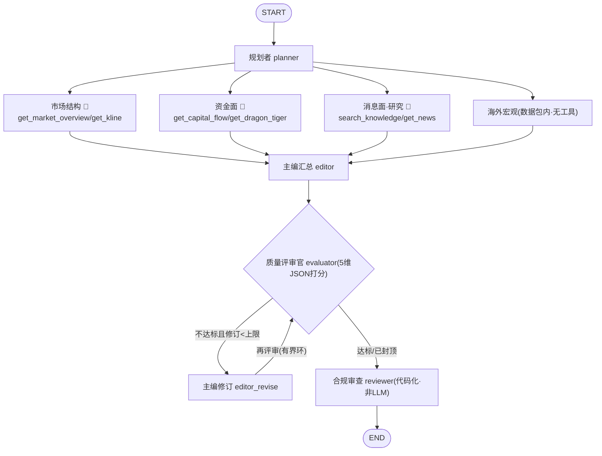

# brad-quant-agent 全面复盘（2026-06-07）

- 范围：截至 `fd8d10b`，46 次提交
- 规模：后端 ~87 个 `.py`、前端 ~82 个 `.ts/.tsx`、后端测试 45 + 前端测试 15
- 形态：FastAPI(:8000) + Next.js 16/React 19(:3000) + Postgres/pgvector，本地 `docker compose` 起

---

## 1 · 项目定位与演进历程

**定位**：面向个人投资者/研究者的 **AI 原生 A 股投研终端** —— 以"AI 看盘驾驶舱"切入（看盘 + 自然语言问答 + 盘前早报），后续延伸模拟交易与真回测。差异化：不与聚宽/BigQuant 拼"研究回测平台"的数据广度，而是 **"一切皆可一句话问到 + Agent 自动取数研判"** 的个人驾驶舱。

**起点 → 现状**：从"半成品"（`Math.random()` 假回测、无 AI、东方财富单一源不落库、Node/Express）演进为"真实数据底座 + 多层 AI/Agent 能力 + 工程化基线"的可日用雏形。

| 阶段 | 关键内容 |
|---|---|
| 地基 | 前后端分离、`DataProvider` 三源抽象、PIT 落库、WS 基座、JWT、水合/CORS 修复 |
| Phase 1 | 看盘进阶版 + AI 看盘问答（11 工具 function calling）+ 黄金集 36 题全量回归 |
| Phase 2 | AI 盘前早报（离线数据装配 + 合成 + 定时生成）+ 自主深度研究（多轮规划编排） |
| AI 增强 | RAG → 多智能体早报(LangGraph)+ 可观测 → 反思回环 + 分析师调工具 + 轨迹甘特 → 深研持久化 |
| 工程化 | LLMQuant MCP 取数 + 缓存、WS 私有通道、数据回填、CI + Sentry + ruff 基线、连通修复、UI 打磨 |

---

## 2 · 架构与技术栈

| 层 | 选型 |
|---|---|
| 前端 | Next.js 16.2.6 / React 19 / TypeScript / Tailwind v4 / Zustand / ECharts / react-markdown / Vitest |
| 后端 | FastAPI(async + 原生 WS) / SQLAlchemy / Pydantic / APScheduler / pytest + ruff |
| 数据 | Postgres + pgvector；PIT 字段预留；三源 `DataProvider` 可热插拔 |
| AI | DeepSeek(function calling) / LangGraph + langchain-openai / sentence-transformers(bge-small-zh) / MCP 客户端 |
| 可观测·运维 | Docker Compose / GitHub Actions CI / Sentry(可选) / LangSmith(可选) |

**关键取舍**：① 统一工具底座（问答/多智能体/深研三处复用）；② SSE 管文本流、WS 管实时与私有回报；③ 处处降级（超时/返空/显式标“暂无”），绝不阻塞、绝不杜撰。

---

## 3 · 能力完成度 vs SPEC

| 模块 | 状态 | 说明 |
|---|---|---|
| Phase 0 地基 | ✅ | 分离/三源/PIT/WS/JWT/调度器/Docker |
| Phase 1 看盘 + AI 问答 | ✅ | 自选股、个股详情、选股工具、嵌入式+独立问答 |
| └ AI 准确性(红线) | ✅ | 黄金集 36 题：工具选择 100%、合规 100%、杜撰 0、报价一致 100% |
| Phase 2 AI 早报 | ✅ | 离线装配 + 多智能体合成 + 每日定时 + 落库可复盘 |
| └ 对话中枢/自主深研 | ✅ | 规划→分步调研→成稿 + 持久化回看 |
| AI 增强：RAG | ✅ | pgvector + 本地 bge；documents 253 块 |
| AI 增强：多智能体+可观测 | ✅ | 四分析师并行→主编→evaluator-optimizer→合规；轨迹/SSE/甘特/LangSmith |
| AI 增强：海外数据(MCP) | ✅ | LLMQuant 美宏观 + wiki，TTL 缓存 + 每日刷新 |
| 工程化 | ✅ | CI / Sentry / ruff / WS 私有通道 / 数据回填 |
| **Phase 3 模拟交易** | ❌ 未开 | 前置已就位（WS 私有通道 + 研究记录可复用） |
| **Phase 4 回测引擎** | ❌ 未开 | 仅占位页；复权因子部分回填(44) |

**缺口**：① 数据覆盖（minute=0、复权仅 44、daily/资金流偏少）→ 阻塞 Phase 4；② 功能未开（模拟交易/回测/策略）；③ AI 后续（HNSW+混合检索、轨迹下钻）；④ 验收收尾（首屏<2s 未正式测量）；⑤ 无自动化 E2E。

---

## 4 · AI/Agent 架构亮点

**主线：一套能力底座，承载三种编排拓扑。**

1. **能力层与编排层解耦** —— 11 工具 + `DataProvider` + RAG，三种编排零改动复用，正交扩展。
2. **LangGraph 状态图** —— `TypedDict` 状态、四分析师 fan-out 并行（`trace` 用 `operator.add` reducer 归并并发写）、主编后条件边、`evaluator⇄editor_revise` 有界循环。
3. **Evaluator-Optimizer 自纠正回环（有界）** —— 5 维 JSON 评分→不达标修订再评审，轮数配置封顶（硬上限 3）。
4. **节点级工具增强** —— 各分析师按白名单按需调工具，`max_rounds` 有界，空响应兜底强制出文。
5. **规划-执行-综合（深度研究）** —— 规划拆子问题→每子问题独立 ReAct 取数→主笔综合，复用 ReAct 子例程。
6. **流式 + 节点级可观测** —— 每节点 `{ms, chars, tools, scores, start/end}` 落库 + SSE 进度 + 前端甘特 + LangSmith 可选。
7. **MCP 客户端编排 + Agent 安全/成本工程** —— 后端充当 MCP 客户端取数；TTL 缓存、超时降级、有界轮次/修订、优雅空。

**早报多智能体状态图**：

**简历 bullet（Agent 架构向）**：
- 设计“一套工具底座 × 三种 Agent 编排”架构（反应式 ReAct / LangGraph 图式多智能体 / 规划-执行-综合深研），共享 11 工具 + RAG，正交扩展。
- 用 LangGraph 实现并行分析师(reducer 归并) + 条件路由 + 有界反思环(evaluator-optimizer)，修订轮数配置封顶；节点级轨迹/甘特/LangSmith 全程可观测。
- 将鲁棒性与成本控制做进编排层：节点工具调用有界、超时降级、TTL 缓存、MCP 客户端取数。

---

## 5 · 工程质量与技术债/风险

**质量基线**：测试 45(后端)+15(前端)+黄金集回归脚本；CI(ruff+pytest+pgvector 服务容器 / eslint+build)；安全(JWT+refresh 校验、生产强制非默认密钥、CORS 收紧、contextHint 当不可信元数据)；韧性(超时降级、有界轮次、优雅空、WS 重连上限)；可观测(Sentry/LangSmith 可选 + 节点轨迹)。

| 级别 | 项 | 说明/影响 |
|---|---|---|
| 高 | 数据深度不足 | minute=0、复权仅 44、daily/资金流偏少 → 阻塞 Phase 4；免费源限流是结构性风险 |
| 高 | 无自动化 E2E | 靠人工浏览器才抓到 `:3001` 连通 bug → 回归易漏；需 Playwright E2E |
| 高 | 成本无闸 | 深研一次多轮工具+LLM 调用，无总预算/限流闸 |
| 中 | Agent 编排缺单测 | brief_graph/deep_research/orchestrator 无 mock-LLM 测试 |
| 中 | 环境脆弱 | 前端 API 地址默认曾错、`.env.local` 缺即坏；Docker/Postgres 闲置常掉 |
| 中 | 可观测下钻缺 | 轨迹只到 ms/tools/scores，看不到节点输入/输出原文 |
| 低 | 多用户/配额 | RBAC 仅预留；落库无配额/清理；Redis 限流后置 |
| 低 | PIT 未验证 | PIT 字段预留但未经回测验证未来函数/幸存者偏差 |
| 低 | 运维/密钥 | 无密钥轮换/secrets 管理；云部署未做 |

---

## 6 · 决策与教训 + 下一步路线

**做对的决策**：① 废弃 Node 改 FastAPI（async+WS+Python AI 生态）；② 先建好工具底座再做上层（多智能体/深研零改动复用）；③ 数据落库 + DataProvider 抽象 + PIT 预留；④ 早报用离线数据包而非实时取数（同时规避限流与杜撰）；⑤ 合规护栏 + 可衡量黄金集；⑥ 可观测第一天内置 + 处处降级；⑦ 增量小步提交 + 每步验证。

**踩过的坑（教训）**：
- 前端默认连 `:3001`(旧 Express)：单测/类型/build 全过、整链路却坏 → **面向用户的流程必须真实 E2E，静态检查给不了这种信心**（最大教训）。
- 闲置 Docker/Postgres 频繁掉 → 本地依赖需"起服务前置检查"兜底。
- 早期评测脚本假阴性（把"诚实说没有"误判为杜撰）→ 评测逻辑本身也要复核。
- 实时源限流致挂起 → 外部 IO 一律超时降级。
- Next 16 严格 hook 规则 / 安全 hook 误伤 → 升级与工具链的隐性维护成本。

**下一步路线**：

| 优先级 | 事项 |
|---|---|
| P0 | ① 自动化 E2E(Playwright) 固化登录/问答/深研/早报；② 成本闸(预算+限流)；③ 启动 Phase 3 模拟交易(orders/positions/trades + T+1 撮合 + WS 私有通道推成交回报 + AI 复盘) |
| P1 | 数据深度：批量补分钟 K + 复权因子(更宽标的)；RAG HNSW + 混合检索 |
| P2 | Phase 4 回测引擎：backtrader/qlib，策略 API 对齐 RQAlpha/聚宽，列存(DuckDB/Parquet) |
| P3 | 轨迹下钻、首屏<2s 收尾、云部署、RBAC/Redis |

**总评**：从半成品成长为"AI/Agent 主轴闭环 + 工程化基线"的可日用雏形；最大资产是"一套底座×多种编排"的 Agent 设计与可观测/合规体系，最大待补是"数据深度 + 自动化 E2E + 成本闸 + 交易/回测"。高杠杆动作 = P0。
